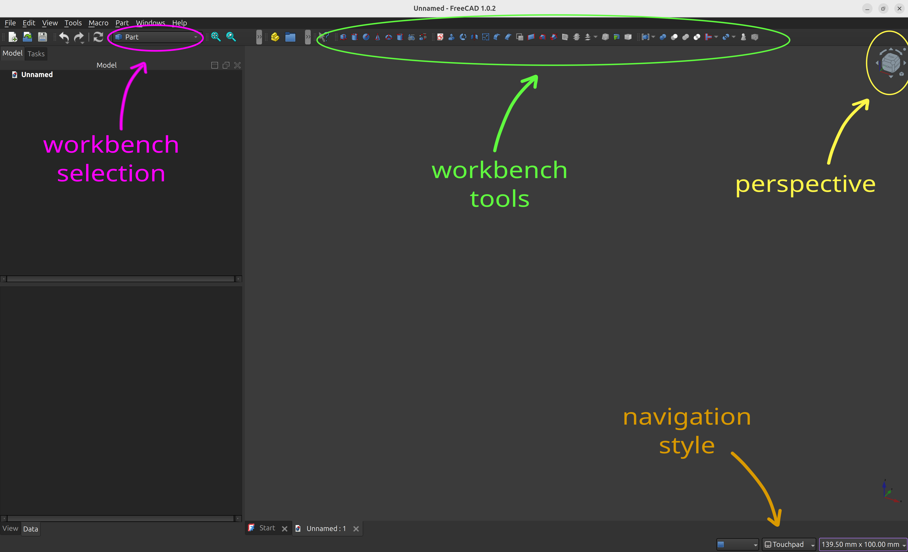
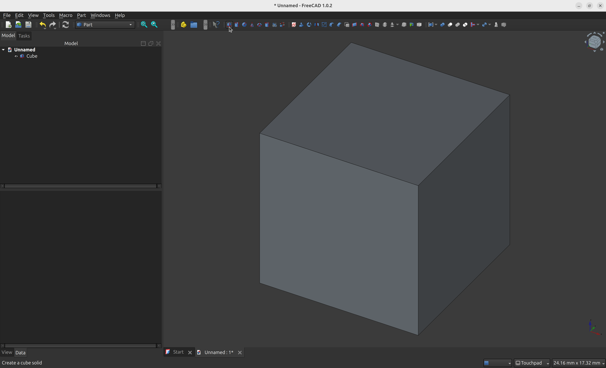
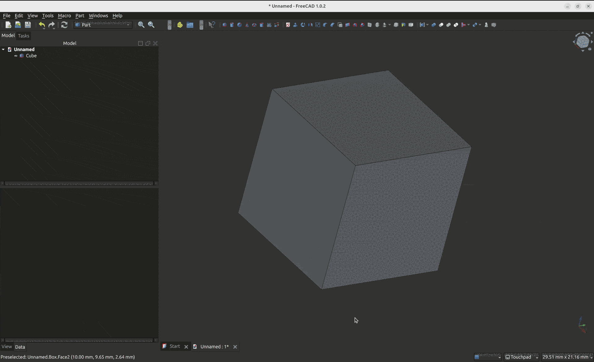
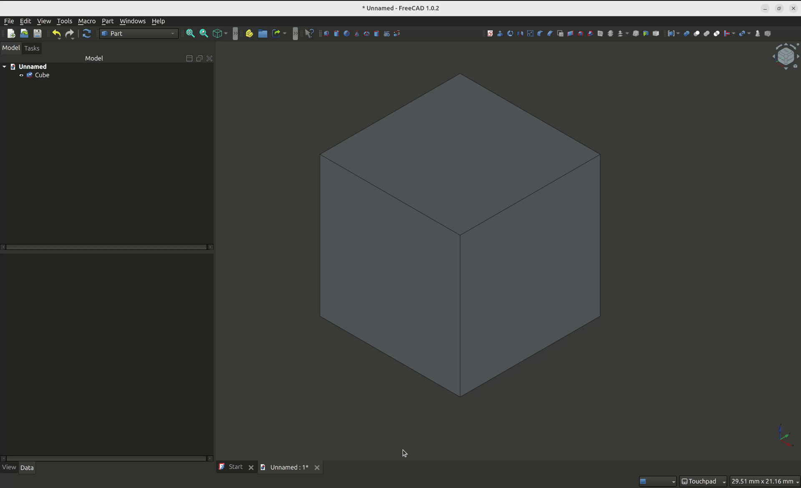
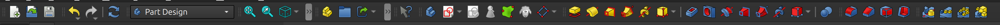
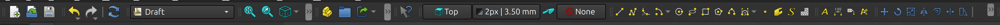
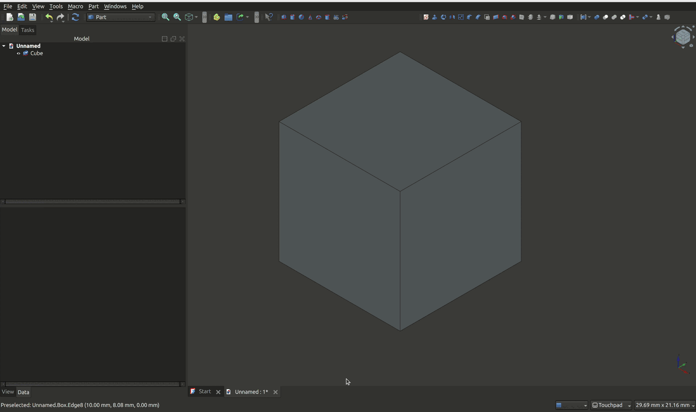

As the name suggests, [FreeCad](https://www.freecadweb.org/) is a free and open source CAD software, a parametric modeler that can be used to design 3D objects for printing. It is available for Linux, Mac, and Windows users. Despite being a well established project with over 2 decades of development, it's 1.0 version came out just recently, solidifying FreeCAD as a robust choice for CAD design on all platforms.

In this introduction to 3D design with FreeCAD, you'll learn the basics about the software, some important concepts, and how to navigate the user interface. Then, we'll see step-by-step how to use the Part Design + Sketcher workbenches to create a simple pen holder that can be 3D printed.

If you want to follow along, now is a good time to [get FreeCad installed](https://www.freecadweb.org/downloads.php) on your computer before moving ahead.

## FreeCAD Basics

There are a few concepts you should get acquainted early on:

- **Workbench**: FreeCAD has a series of workbenches for different purposes. Most of the time, though, you'll be working with the **Part Design** and **Sketcher** workbenches.
- **Sketch**: A sketch is a technical drawing representing an object or part of it. The sketch uses different geometry to represent a part in 2D. Once all wires are closed and you have a valid form, you can turn it into a solid part. 
- **Constrain**: Constrains are the glue to create parametric models. They allow you to assure things such as distance between two points, width /  height of a line, diameter of a circle, and so on... constrains support formulas and variables, features that can be used to generate custom models in multiple sizes.

## The Interface

At first sight, FreeCAD's interface may look less intuitive (or too "bare") than other design software you might be used to work with. But once you get familiar with the general concepts of how to work with the interface, how to switch between workbenches, and how to manipulate planes and perspectives, you'll be in a much better position to explore and experiment with different methods for designing objects.

Unless you are already used to a different navigation style from another CAD software, I recommend changing the default interface navigation to "Touchpad". To do that, look for the navigation style select box at the bottom right portion of FreeCAD's UI. 

## Creating a Simple Solid

To experiment with the interface, you can create a new model in **File -> New**, then open the **Part** workbench and click on the Cube icon to create a new solid cube.

## Navigating XYZ

When designing 3D models, one of the most important things to get used to at first is the **Z** axis, and how to navigate different perspectives.

Most of us are familiar with X and Y, but when designing 3D objects you'll work with a third axis: Z. You'll typically work from a top view of the object you're designing; Z in this case is the axis that represents the depth of the object. In many cases, Z might simply represent the extrusion width. Wait - what is an extrusion? We'll get there in a moment.

On FreeCad, you can see the axis position on the bottom right of the screen, and the top right shows a cube with a more user-friendly view of the same information.

Here are the two most important controls, using the Touchpad navigation style:

- `SHIFT` + Mouse move: Move the object on the screen without changing the perspective.
- `SHIFT` + `LEFT CLICK` + Mouse move. This will move the object freely across different axis. Like you're handling the object in front of you with one hand.

Additionally, the zoom controls are:

- Zoom In: `SHIFT` + `CTRL` + `+` key, or `SHIFT` + `CTRL` + Mouse move.
- Zoom Out: `CTRL` + `-` key, or `SHIFT` + `CTRL` + Mouse move.

If you "lose" the object, you may use the magnifying glass icon on the top left, and that will fit the whole content on the screen.

## Working with Perspectives

In most 3D design applications, you'll work with different perspectives that are exhibited in the screen as a 2D image, representing different possible combinations of X, Y, and Z. Depending on the software you use, there might be different shortcuts for accessing default perspectives. On FreeCAD, you can use keys from **0** to **6** to control the perspective:

- **0** : Isometric
- **1** : Front
- **2** : Top
- **3** : Right
- **4** : Rear
- **5** : Bottom
- **6** : Left

You can also use the perspective buttons close to the magnifying glass to change the perspective of the model, they essentially do the same thing as the shortcuts.

## Navigating through Workbenches

Workbenches provide different tools that are grouped to target different design workflows. Some workflows may require the use of multiple workbenches. As an example, the Sketcher workbench is typically used with the Part Design workbench to create parts based on a 2D sketch.

To navigate to a different workbench, you may use the workbench select menu on the top of the screen. You'll notice that the menu tools will change depending on the workbench selected:

## Saving an STL file

To save a model as an STL file that you can slice and print with a 3D printer, you first need to select the object you want to export, from the "Model" view on the left navigation sidebar, and then go to **File** -> **Export** menu. Make sure to select "STL Mesh" on the file type.

## Next Steps

You learned the basics of how to navigate FreeCAD's interface, how to move between workbenches, and how to create a simple solid in the Part design and export the STL mesh for 3D printing. In the next post of this series, you'll learn how to create a simple pen holder using FreeCAD's Part Design and Sketcher workbenches. In the meanwhile, check out [FreeCAD wiki](https://wiki.freecad.org/Main_Page) in case you want to learn more about this tool.