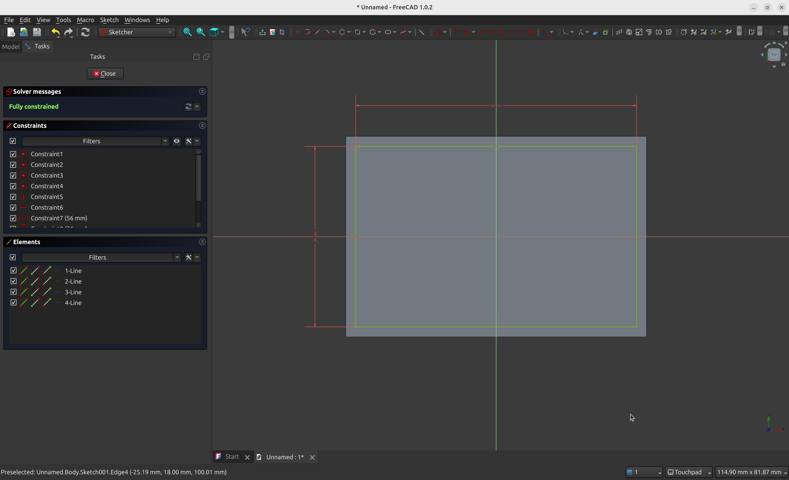

Sketcher and Part Design are two [FreeCAD workbenches](https://wiki.freecadweb.org/Workbenches) that work closely together, typically used to turn 2D geometries into 3D models. In a nutshell, through the Sketcher workbench you create the blueprints of parts that are manipulated through the Part Design workbench.

We'll now see how to use the Sketcher and Part Design workbenches to create a minimalist pen holder model that you can print with a 3D printer.

Before continuing, it is important that you have FreeCAD installed on your machine, and that you are familiar with how to navigate the interface. If you haven't checked my previous post on [FreeCAD for Beginners](/posts/freecad-for-beginners), now is a good time do to so!

The full tutorial is available in video (below), but text instructions are included in the article for all steps, if you'd prefer to follow along by text.

<iframe width="100%" height="540" src="https://www.youtube.com/embed/t_e96M4iLN4?si=q-ax6Ob6K7a4fLzc" title="YouTube video player" frameborder="0" allow="accelerometer; autoplay; clipboard-write; encrypted-media; gyroscope; picture-in-picture; web-share" referrerpolicy="strict-origin-when-cross-origin" allowfullscreen></iframe>

## Step 1: Create a new project, then move to the Part Design workbench

Create a new project, then select the "Part Design" workbench on the workbench selection box.

## Step 2: Create a new body, and then create a new Sketch. Choose XY as base plane.

You can use the shortcuts on the left sidebar to create a new body, and then create a new sketch on that body. When creating the sketch, select the XY_Plane.

## Step 3: Select the square/rectangle tool, then create a rectangle at the center of the canvas.

Don't worry about the size now, we'll set up constraints in the next step.

## Step 4: Centralize the object with the symmetry constrain

Constraints allow you to specify a set of rules that can be applied to points, lines, and angles. This constrains creates a symmetry rule between two points and a reference line or point. 

Select the the top left point of the sketch, the bottom right point of the sketch, and then the 0,0 point of the plane. Then, select the symmetry constrain to centralize the object.

## Step 5: Select the horizontal width constraint, then set the size of 60mm. 

If you look at the "Solver Messages" dialog on the top left, you'll notice it says "Under-constrained: 2 DoF(s)". This means your design is not "locked in place", and there are 2 dimensions in which it can move. That might not seem like a big deal (and in many cases it isn't), but it's preferable to have your sketch fully constrained to serve as solid base for other parts of your design.

We'll now set the horizontal width constrain to limit the horizontal size of the object.

## Step 6: Select the vertical width constraint, then set the size of 40mm.

Repeat the process to set up the vertical width of the pen holder.

You'll notice that as soon as you finish setting up the width and height constrains, your sketch will be green and the Solver messages dialog will display **Fully constrained**.

## Step 7: Select the pad tool and pad to the height of 100mm.

Close the sketch. This will bring you back to the Part Design workbench, automatically. You can then select the pad tool, setting the type to Dimension and the height to 100mm. Click  "ok" to confirm.

## Step 8: Create a new sketch based on the top face.

Select the top face of the object, then click on the sketch button to create a new sketch using that face as attachment.

:::tip
All sketches must be attached to a plane or face. When we first created a sketch in Step 2, we attached it directly to the XY plane. This time we're attaching the sketch to an existing face.
:::

## Step 9: Create a rectangle form slightly smaller than the first one, using the constraints of 56mm and 36mm for width and height, respectively.

Repeat the process from steps **3** to **6** to create a smaller rectangle of 56x36mm inside the previous one. We'll use this sketch to create a "pocket", turning the initial rectangle in a box, leaving 2mm at each side as border. Make sure it's centralized so all borders have the same thickness. 

This is how the sketch should look like when you're finished:

## Step 10: Use the pocket tool to hollow the model.

Close the sketch, and you will be brought back to the Part Design workbench. Then, use the pocket tool instead of pad - this time we want to create a pocket to make the model hollow. Select the "Dimension" type and the length of 90mm, which will leave 1cm for the bottom.

## Step 11: Use the fillet tool to round the edges slightly.

For a final detail, you can use the fillet tool to round some edges. Select one of the faces of the model, then select the "Fillet" tool. Click on the "add ref" button to add all external faces, one by one. Rotate the model and add the other faces. You can use the radius of 1mm for a discrete effect. When you're done, click the "OK" button.

And it is done! If you want to print this model, you can export it through the menu `File -> Export`, then choose the **STL** format. You can then import the STL to a slicer software to get it ready for printing.

I hope you have enjoyed this tutorial. Check also other posts under the [3d printing](/tags/3d-printing) tag!

