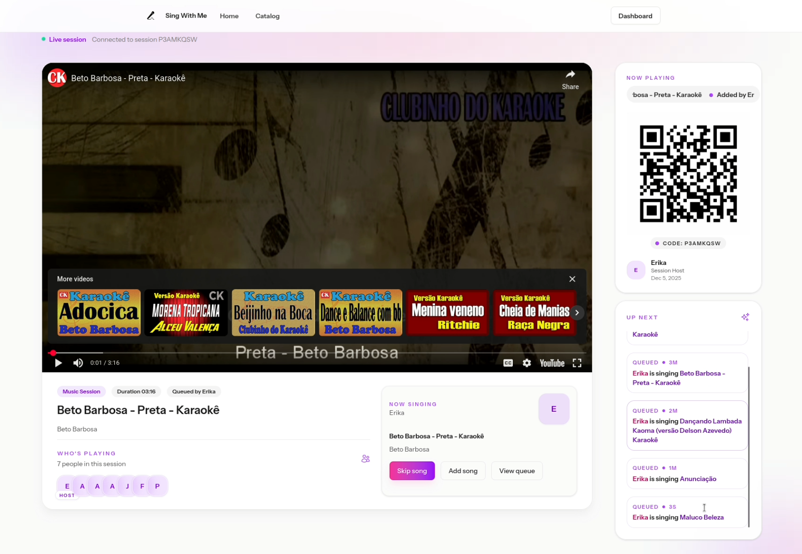

As some of you may know, I am from Brazil. Brazilians love music, and it's not different within my family! Every time I go to Brazil, we have karaoke parties. Our setup for karaoke is quite simple, with a speaker and two microphones connected directly to it, and a phone connected via bluetooth, playing YouTube karaoke songs.

This year I thought: "what if I build a little app to improve our setup?". The app could still use YouTube (with embeds) as a source of karaoke songs, since making the songs was out of the table. Keeping it simple, I could build an app to make the experience more integrated and social. 

There was just one small problem: I only had two weeks :D I am going to Brazil for the Holidays, and there's just no time left to develop such a thing. But wait... What if I use Copilot? With AI assistance, _maybe_ I could pull this up. Mind you that I still have to work and handle life in general in this time frame, so I will be coding mostly after working hours and in the two weekends I have before traveling.

Mind you that I have been very skeptical about _vibecoding_ in general so far, being a firm believer that vibecoding is just a quick way to introduce tech debt to your app. But this idea created the perfect opportunity to put this to test, and evaluate what's currently possible with Copilot. I decided to use a stack I am very familiar with: Laravel + Livewire, with TailwindCSS. Mind you that I haven't touched Laravel code in about 2 years, so I knew a lot of things have probably changed, but the core was the same and it would be easier for me to debug and understand what was going on.

I also defined the most important features I wanted in my karaoke app:

- Catalog with curated karaoke videos from YouTube (will need a CRUD for that)
- A Player endpoint that would play the songs in the queue (probably Javascript-heavy, since it needs to skip songs, auto update, etc)
- A way for players to join a single session together and interact
- A way for players to add songs to the queue

In this post, I will share my experience in the past week building this app. Is it really possible to develop an app like this in such a short timeline? The TL;DR is: yes, if you kinda know what you're doing.

I made this silly video to show off:

<iframe width="560" height="315" src="https://www.youtube.com/embed/9hURUE1K9Fk?si=zZrFgAAMILc-l_0K" title="YouTube video player" frameborder="0" allow="accelerometer; autoplay; clipboard-write; encrypted-media; gyroscope; picture-in-picture; web-share" referrerpolicy="strict-origin-when-cross-origin" allowfullscreen></iframe>

## Phase 1: Off to a Bumpy Start

In my first experiment, I bootstrapped a new Laravel app following official docs, but I did **not** know what [Laravel Boost](https://laravel.com/ai/boost) was, so I chose not to install it. That was my first mistake.

After I had a basic Laravel app with Livewire up and running, I asked Copilot (in Agent mode) to implement the Song model and CRUD, with dashboard pages to manage all (this in a single prompt - my second mistake). I was using the default model that comes pre-selected (gpt5-mini). Copilot proceeded with the implementation and soon I had some dashboard pages where I could manage Songs. Impressive! This was working, but did not use Livewire at all. I forgot to mention that in my prompt, so it just created regular controllers under authentication. I asked it to update to use Livewire, and it did re-implement the CRUD features using a Livewire component, but left the controllers there "just in case".

It did not work at first, thou. Then I realized it was saving Livewire components to the wrong folder. I also got Javascript errors about a call to an undefined "emit" method. I then realized it was using Livewire 2 syntax, but we had Livewire 3 in our project. I fixed it, but every time I asked for a Livewire thing, it would do this, I would have to fix, and things started to look chaotic fast. It also didn't leverage [Volt](https://livewire.laravel.com/docs/3.x/volt), and I personally did not know what that was either. Later on I read the documentation and realized Volt would facilitate SO MUCH writing Livewire components because you could have everything in a single file.

That's when I got an email from the [GitHub Stars](https://stars.github.com/) program asking us Stars to try a new model that was being made available to us for feedback. Since I was already in this quest, I decided to give it a try. 

## Phase 2: A New Hope

To use the new model, I had to install VS Code Insiders, which is a version of VS Code for early adopters. It lets you try the most recent features of VS Code without changing your default installation. As soon as I opened the project in VS Code Insiders, Copilot asked if I wanted to generate a helper file (copilot-instructions) to facilitate AI assistance in this code base. I said YES. 

I then asked it to create new Livewire components and it got it right in the first try. No more outdated syntax. The code looked very good and organized, in line with the official docs. Still not using Volt, but overall much better.

Things started to get more complex as I moved to more complicated features that used a lot of Javascript. While implementing the Player, Copilot suggested using Broadcasting with Reverb - another shiny thing I knew nothing about. I accepted the suggestion and _some_ things worked, but I couldn't figure out why all the other things were not working. The player template looked very complex with tons of JS. I would prefer things a bit simpler, and I couldn't really understand the interactions happening between Livewire and Reverb / Echo.

Honestly, it just felt like I did not know what I was doing, and I was not in control.

That's when I decided to start fresh. With several lessons learned on how to deal with the process and how to ask for what I wanted, I bootstrapped a **new** Laravel project, and this time I did install Laravel Boost. 

## Phase 3: I'm Again in Control

Laravel Boost created a copilot instructions file right away during installation, and the whole experience was **completely** different. Instead of creating all files manually, Copilot now was using the proper Artisan commands to do everything, which improved the code standards and organization by a ton. This really made a huge difference. I even reproduced the issue to prove my assumptions, here is the comparison before and after installing Laravel Boost on a fresh Laravel application:

![The image shows two panels, both showing a Copilot chatbot window, asking the question: "what is the correct location for Livewire component logic". The left one has a red title "Without Laravel Boost", and a red circle highlights that the AI chat replies with the wrong location (app/Http/Livewire). The right panel shows the correct answer (app/Livewire), there's a green text saying "With Laravel Boost" and a circle highlighting the correct location for Livewire components as answered  by the chat bot. Both use the same model (gpt5-mini), so it's clear the difference was caused by having Boost installed.](laravel-boost-before-after.png)

This time around, I did plan **everything** beforehand, and I asked Copilot to implement small steps each time. For example, I asked first for a Song Eloquent model, with migration and tests; after that was done and working, I asked for the CRUD implementation in the dashboard, using standards already present in the project. It worked flawlessly, using Livewire with Volt.

Another important measure that I took was creating a Git branch every time I was going to implement a new feature. Commit everything and have separate branches so you can revert easily when things don't work right away. 

One thing I realized is that when things don't work, you have to be careful because the AI agent will try *hard* to fix it in any way possible, which can introduce a lot of code you don't fully understand. Things start to get complex (while still not working), and if they do work eventually, you already lost track of what was the real issue. My advise is to don't dig too much, be ready to revert early if some fix didn't work, before changes get out of your control.

## Biggest Challenges

So far, the biggest challenge has been implementing [Broadcasting](https://laravel.com/docs/12.x/broadcasting) with Laravel [Reverb](https://laravel.com/docs/12.x/reverb). I first tried with Copilot implementing everything for me, but it did not work. Events were not being triggered at all, no errors and nothing on the logs to indicate the problem. Since this touches many different parts of the application (including front-end), it was a critical implementation and I felt that I should dedicate time to go through a manual implementation this time.

So I reverted the changes and followed the docs thoroughly in order to integrate Reverb and Echo in my application. This time, I finally understood how things get wired, how the subscription with Echo works in the front end, and how to interpret the logs at each side (Laravel logs and Reverb logs). I got as far as dispatching jobs (I could see them being worked in the queue logs), but the events would still not reach Echo.

After spending quite some time trying to fix this (and knowing I was **so** close), I asked Copilot to help investigate and debug the problem. Took Copilot 10 minutes but it did find the problem and fixed it. There was a missing ServiceProvider in my app, so the events where triggered but not broadcasted (and also no errors thrown). There was nothing about a ServiceProvider in the official documentation, so I was impressed it could find and fix the issue. 

While Laravel Reverb has made a big difference in the overall development process, I believe the model I'm testing is far superior then gpt-mini, so there's that too.

## Wrapping Up

Today, at the one week mark, I have about 80% of the application ready. Broadcasting is working, I can manage Songs and Tags from the dashboard, the player is working with auto-forward and all, the queue is working with songs added by different users, and there is a companion mode to join the session from a mobile phone. Of course, there are some rough edges to smooth out, front-end adjustments, and a few other details. But the bulk of it is already working, which is great! I am very surprised by this experience, I did not think it would go the way it went. 

With regards to AI assisted coding, my key takeaways are:

- Always be in control
- YOU should be the architect; don't let AI make important decisions on your behalf
- Commit often, revert when things start to get weird (and you feel you're losing control)
- Know your stack, have the docs open at all times
- Don't be lazy - read the docs, understand what is being implemented, touch the code whenever necessary
- Always be in control

I'll be sharing another update after we test-drive the app! :) 

## 2-Week Update (Dec 23)

It's almost Christmas and I had some progress I wanted to share, as well as my honest opinion about the models I have tried (Claude Opus and GPT Codex Max) so I recorded this video update. TL;DR: there are still some things to fix, and I had some issues with the Reverb server on Laravel Cloud, but things are progressing as I just finished setting up a better development environment using Docker Compose. I also need to improve the process for adding new songs, making song curation easier.

<iframe width="560" height="315" src="https://www.youtube.com/embed/e-G3_OD8SKU?si=w0WlTCZwYppDleLz" title="YouTube video player" frameborder="0" allow="accelerometer; autoplay; clipboard-write; encrypted-media; gyroscope; picture-in-picture; web-share" referrerpolicy="strict-origin-when-cross-origin" allowfullscreen></iframe>