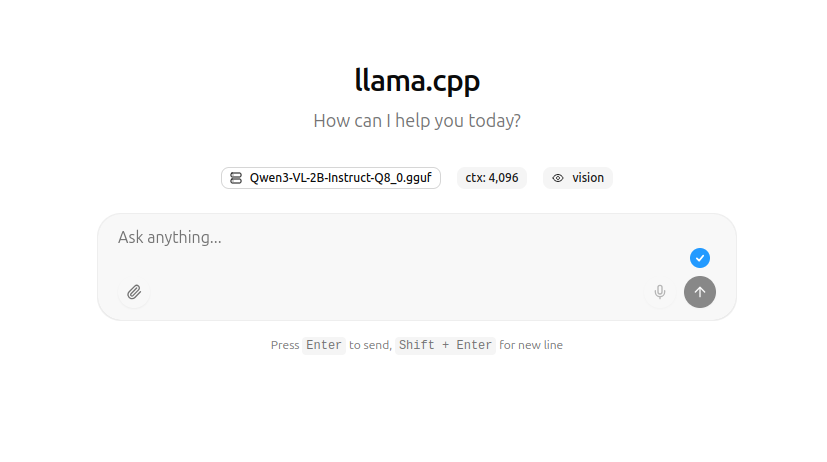

For a long time, I also felt skeptical about LLMs and what they are capable of. The biggest issue for me is the push we're currently seeing from corporations, claiming productivity gains and even the complete replacement of human roles. As an expectator and occasional consumer of chatbots, I started resenting anything that has AI in its name and rolled my eyes at every AI LinkedIn post I saw. I did not want to take part in it.

But that's where things get complicated. If not us, who? Should we let corporate greed drive this future? Or should we, as open source ambassators, get organized and start digginng further to use this technology for public goods? I believe that's the whole idea behind [HuggingFace](https://huggingface.co), an open source AI platform and community with almost 4 million open source LLMs that can be downloaded and used for free in your own infrastructure. Combined with [LLama.cpp](https://github.com/ggml-org/llama.cpp), an open source LLM inference tool written in C++ (very efficient while broadly compatible)

I am not talking about prompt engineering and vibe coding, but actually finding real use cases for LLMs where traditional approaches did not work well. Accessibility is a great example of that; nobody likes (or actually knows how to) to write good ALT descriptions for images, something that is achievable with LLMs trained on computer vision.

In this tutorial, you'll learn how to set up a Raspberry Pi 5 on your local network to run open source LLMs from HuggingFace, using a containerized environment running Llama.cpp. For this example we'll use the [Qwen3-VL](https://qwen.ai/blog?id=99f0335c4ad9ff6153e517418d48535ab6d8afef) LLM from Alibaba Cloud, an open source LLM with advanced text and visual capabilities. According to the [release blog post](https://www.alibabacloud.com/blog/602584):

>The goal of Qwen3-VL is not just to "see" images or videos — but to truly understand the world, interpret events, and take action. To achieve this, we’ve systematically upgraded key capabilities, pushing visual models from simple “perception” toward deeper "cognition", and from basic "recognition" to advanced “reasoning and execution.”

To make our system extra secure, we'll use the [Chainguard OS Container Host for Raspberry Pi](https://www.chainguard.dev/unchained/a-gift-for-the-open-source-community-chainguards-cve-free-raspberry-pi-images-beta), because it contains zero vulnerabilities and already comes with a built-in Docker daemon, so we can get up and running very quickly with a somehow reproducible setup (you still need to manually create the Raspberry Pi boot disk). We'll also use a Wolfi-based container image (**gcc-glibc**) as base for our Dockerfile, since we'll need to build Llama.cpp from source.


## Prerequisites

Here are the things you'll need in order to follow this tutorial:

- A Raspberry Pi 5 
    - A mini hdmi to hdmi cable to connect your Raspberry Pi to a display
    - A keyboard
    - An ethernet connection
- A microSD card (and a microSD reader for your computer so you can build a bootable disk)
- Power source for the Raspberry

To keep things simple and fast, I'm using an ethernet cable plugged directly to my wi-fi modem. The Raspberry Pi gets an IP address from DHCP, and the easiest way to find the IP is to just log into the Raspberry and run `ip addr` to find your local network IP.

The containerized setup also works on a regular computer - in this case, you only need Docker.

## Building the Bootable Disk with Chainguard OS

The first thing you'll need to do is to obtain the image for your Raspberry Pi and use it to create a bootable disk in a microSD card. Go to [this  link](http://images.chainguard.dev/rpi) and use the form to download the **Chainguard Raspberry Pi Docker Image**.

You'll get a `.raw.gz` file. Unpack the file with: 

```shell
gunzip rpi-generic-docker-arm64-*.raw.gz
```

Plug your microSD card to your computer and locate the disk name (for instance, /dev/sda). Then, run:

```shell
sudo dd if=rpi-generic-docker-arm64-*.raw of=/dev/sda bs=1M
```

After this proccess is finished, unmount and remove the microSD from your computer and place it on the Raspberry Pi. 


## Booting your Pi and Finding your IP Address

Connect a display and keyboard to your Pi, and the ethernet cable, then, boot it up. You can login with user **linky** and password **linky**.

Then, run `ip addr` to find out what IP address was given by DHCP to your Pi. You should look for something like this, an `end0` interface:

```shell
2: end0: <BROADCAST,MULTICAST,UP,LOWER_UP> mtu 1500 qdisc fq_codel state UP group default qlen 1000
    link/ether 2c:cf:67:b9:30:93 brd ff:ff:ff:ff:ff:ff
    altname enx2ccf67b93093
    inet 192.168.178.36/24 metric 1024 brd 192.168.178.255 scope global dynamic end0
       valid_lft 52735sec preferred_lft 52735sec
    inet6 2001:1c00:1519:a500:2ecf:67ff:feb9:3093/64 scope global dynamic mngtmpaddr noprefixroute 
       valid_lft 604785sec preferred_lft 604785sec
    inet6 fe80::2ecf:67ff:feb9:3093/64 scope link proto kernel_ll 
       valid_lft forever preferred_lft forever

```

In this case, the Pi address is **192.168.178.36**. You can already go back to your computer (on the same local network) and access the Pi from SSH:

```shell
ssh linky@RASPBERRY_IP_ADDRESS
```

Use **linky** as the password. Now you can control everything from the terminal on your computer.

## Chainguard OS Setup

Unlike Debian-based distros such as Ubuntu, Chainguard OS is based on apk, which makes it similar to Alpine. To update the package manager cache, run:

```shell
apk update
```

We'll need some additional packages to facilitate setup. Run:

```shell
apk add curl git vim
```

You don't need to install Docker, as it's already up and running in this Pi image:

```shell
sudo systemctl status docker
```

```
● docker.service - Docker Application Container Engine
     Loaded: loaded (]8;;file://localhost/usr/lib/systemd/system/docker.service\/usr/lib/systemd/system/docker.service]8;;\; enabled; preset: enabled)
     Active: active (running) since Wed 2025-11-12 13:47:08 UTC; 2 days ago
 Invocation: 3771db7beb624e819b2eec8b7c5e446f
TriggeredBy: ● docker.socket
       Docs: ]8;;https://docs.docker.com\https://docs.docker.com]8;;\
   Main PID: 14287 (dockerd)
      Tasks: 30
        CPU: 40.696s
     CGroup: /system.slice/docker.service
             ├─14287 /usr/bin/dockerd -H fd:// --containerd=/run/containerd/containerd.sock
             ├─21227 /usr/sbin/docker-proxy -proto tcp -host-ip 0.0.0.0 -host-port 25565 -container-ip 172.19.0.2 -container-port 25565 -use-listen-fd
             └─21233 /usr/sbin/docker-proxy -proto tcp -host-ip :: -host-port 25565 -container-ip 172.19.0.2 -container-port 25565 -use-listen-fd
```

## Building the Container Image

To run our LLMs, we'll be using a containerized environment where we'll build Llama.cpp from source, following the [official build instructions](https://github.com/ggml-org/llama.cpp/blob/master/docs/build.md) from the project's repository. 

[This Dockerfile](https://github.com/erikaheidi/wolfi-llama/blob/main/Dockerfile) uses a zero-CVE container image from Chainguard to build Llama.cpp and get its built-in web interface up and running. The web interface is very similar to ChatGPT, but uses your own infrastructure and open source LLMs. 

From inside your Pi (either via SSH or with direct access), clone the demo repository:

```
git clone https://github.com/erikaheidi/wolfi-llama.git && cd wolfi-llama
```

This is the Dockerfile we'll build:

```Dockerfile
FROM cgr.dev/chainguard/gcc-glibc:latest-dev

RUN apk add cmake --no-cache
WORKDIR /opt/llama
RUN git clone https://github.com/ggerganov/llama.cpp.git && cd llama.cpp

WORKDIR /opt/llama/llama.cpp
RUN cmake -B build -DLLAMA_CURL=OFF && cmake --build build --config Release

ENTRYPOINT ["/opt/llama/llama.cpp/build/bin/llama-server"]
```

You can now build the image with:

```shell
docker build . -t wolfi-llama
```

Please notice the build may take several minutes to finish. When it's done, test with:

```shell
docker run --rm wolfi-llama --version
```

You'll get output similar to this:

```
version: 7031 (655cddd17)
built with cc (Wolfi 15.2.0-r5) 15.2.0 for x86_64-pc-linux-gnu
```

You're ready to go, but you still need to download the large language model files, which is coming up next.

## Downloading the LLM Files

There are two files you'll need to download from HuggingFace in order to run the LLMs with Llama.cpp. The main file is the model per se, which is typically a large file - the actual size depends on the number of parameters (values that an LLM learns during training). You can usually choose from a wide range of model sizes like 2B, 8B, 32B and others, where 'B' stands for billions, not the size of the file but still directly related. Larger models produce improved results, but take much longer to run. For models with vision capabilities (which is the case for Qwen3-VL), you'll typically need also a `mmproj` file as well, which works as some sort of bridge between language and image understanding. Without this file, Qwen3-VL can't process images.
 
You can find [here](https://huggingface.co/collections/unsloth/qwen3-vl) a list of Qwen3-VL models available for download on Huggingface. For the Raspberry Pi, this [2B Instruct version of Qwen3-VL](https://huggingface.co/unsloth/Qwen3-VL-2B-Instruct-GGUF) looks like the best option.

The [Files and versions](https://huggingface.co/unsloth/Qwen3-VL-2B-Instruct-GGUF/tree/main) tab contains the actual model files you can download. Understanding the different types can be difficult at first, so let's just download the [2B-Instruct-Q8_0](https://huggingface.co/unsloth/Qwen3-VL-2B-Instruct-GGUF/blob/main/Qwen3-VL-2B-Instruct-Q8_0.gguf) version as it's what worked well for me :)

From the terminal on your Raspberry Pi (or in your computer), download the main model file:

```shell
curl -L -O https://huggingface.co/unsloth/Qwen3-VL-2B-Instruct-GGUF/resolve/main/Qwen3-VL-2B-Instruct-Q8_0.gguf?download=true
```

Then, download the mmproj file:

```shell
curl -L -O https://huggingface.co/unsloth/Qwen3-VL-2B-Instruct-GGUF/resolve/main/mmproj-F32.gguf?download=true
```

Place these files in the  `models` folder from the demo repository you cloned earlier:

```shell
mv ~/Downloads/*.gguf ./models
```

Now you are all set to run Llama.cpp with the Qwen3-VL model.

## Running the Llama Server
With everything in place, you can now run your local LLM server. Llama.cpp has a few different executables, but running the `llama-server` is the most straightforward way of interacting with the LLM since it has a web interface similar to ChatGPT with a prompt and the ability to attach images and other files.

[This page](https://docs.unsloth.ai/models/qwen3-vl-how-to-run-and-fine-tune) from the Unslolth docs has recommended settings for best results. We'll include them as parameters to the `llama-server` entrypoint.

Based on those and other docs, and after testing various settings, this is what I used on the Raspberry Pi to bring up the llama-server with a port redirect, using volumes to share the model files with the container:

```shell
docker run --rm --device /dev/dri/card1 --device /dev/dri/renderD128 \
 -v ${PWD}/models:/models -p 8000:8000 wolfi-llama:latest --no-mmap --no-warmup \
 -m /models/Qwen3-VL-2B-Instruct-Q8_0.gguf --mmproj /models/mmproj-F32.gguf \
 --port 8000 --host 0.0.0.0 -n 512 \
 --temp 0.7 \
 --top-p 0.8 \
 --top-k 20 \
 --presence-penalty 1.5
```

It may take a few seconds to the server to start up. You should see logs like this when it's ready:

```
main: server is listening on http://0.0.0.0:8000 - starting the main loop
srv  update_slots: all slots are idle
```

You can now head to your browser and access your Raspberry Pi's IP address on port `8000` to access the LLM chat. You'll get a page like this:



For instance, I will ask it to describe a picture of my dog for someone with low vision. Processing images takes a lot of tokens, so this may take several secons to complete, but it does work at the end. The size of the image makes a big difference in prompt proccessing time, so it's best to size down and lower the quality of the image to make it smaller before uploading it.

![Screenshot of the chat with llama.cpp showing a picture of a dog and a very accurate description that says "This is a close-up photograph of a black French bulldog lying on a grey, ribbed fabric couch. The dog has a short, smooth coat and is looking directly at the camera with wide, dark eyes. It has a distinct facial structure with a wrinkled forehead and small, erect ears. A small patch of white fur is visible on its chest. The dog is holding a pink plush toy in its front paws; the toy is somewhat worn and appears to be a doll or a bear. The background is softly blurred, keeping the focus on the dog and the toy."](prompt.png)

> This is a close-up photograph of a black French bulldog lying on a grey, ribbed fabric couch. The dog has a short, smooth coat and is looking directly at the camera with wide, dark eyes. It has a distinct facial structure with a wrinkled forehead and small, erect ears. A small patch of white fur is visible on its chest. The dog is holding a pink plush toy in its front paws; the toy is somewhat worn and appears to be a doll or a bear. The background is softly blurred, keeping the focus on the dog and the toy.

With 2B instructions, the result is very good in my opinion and I think there's no way I would detail the picture so much if I was going to describe it myself. 

But I was curious to see what a larger version of the model would produce, so I got the 32B version of this model and run it with the same prompt and picture on my 128GB/32CPU PC (it was slooooow):

![Output produced by 32b model: "This image features a small, dark-colored French Bulldog lying comfortably on a soft, ribbed gray couch. The dog has large, expressive, round eyes that appear alert and curious, and its ears are perked up, adding to its attentive expression. The dog’s coat is mostly black or dark brindle, with a small patch of white fur on its chest. Its mouth is slightly open, revealing a few small teeth, giving it a playful or slightly grumpy look. In front of the dog, resting on the couch, is a pink plush toy that resembles a small creature or bear. The toy has a fuzzy, textured pink body and a light beige face with large, round blue eyes, a small pink nose, and a black mouth. The toy appears worn and well-loved, suggesting it’s a favorite plaything. The overall scene feels cozy and warm, with the dog appearing relaxed and content in its home environment, possibly enjoying a quiet moment with its favorite stuffed companion. The couch fabric has a vertical ribbed texture that adds depth and softness to the background."](32b-output.png)

>This image features a small, dark-colored French Bulldog lying comfortably on a soft, ribbed gray couch. The dog has large, expressive, round eyes that appear alert and curious, and its ears are perked up, adding to its attentive expression. The dog’s coat is mostly black or dark brindle, with a small patch of white fur on its chest. Its mouth is slightly open, revealing a few small teeth, giving it a playful or slightly grumpy look. In front of the dog, resting on the couch, is a pink plush toy that resembles a small creature or bear. The toy has a fuzzy, textured pink body and a light beige face with large, round blue eyes, a small pink nose, and a black mouth. The toy appears worn and well-loved, suggesting it’s a favorite plaything. The overall scene feels cozy and warm, with the dog appearing relaxed and content in its home environment, possibly enjoying a quiet moment with its favorite stuffed companion. The couch fabric has a vertical ribbed texture that adds depth and softness to the background.


It's very interesting to see the difference between model versions. It really looks like there's more reasoning (or interpretation?) on the 32B model, but the 2B model is much more lightweight and produces solid enough results for ALT descriptions. You'd need a lot more processing power than what is available at a Raspberry Pi 5 to run those!

## Conclusion
Getting involved with LLMs in the context of open source goes much beyond prompt engineering and vibe coding;  it's about finding the edge cases where LLMs can really be useful for humans. Accessibility is a great example of legit application of computer vision in LLMs. In terms of privacy concerns, running everything in your own infrastructure gives your power back, since you can even block access to external networks and keep your LLMs completely offline.

While many expect that "the AI bubble will soon burst", I believe it's a good idea to get involved and try these tools for yourself to understand how they work. Without massive involvement of the open source community, we let private organizations dictate where the technology goes, and we don't really want that. 