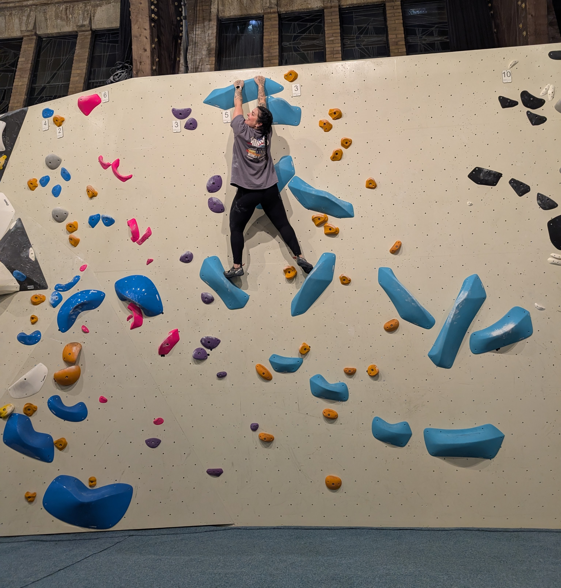
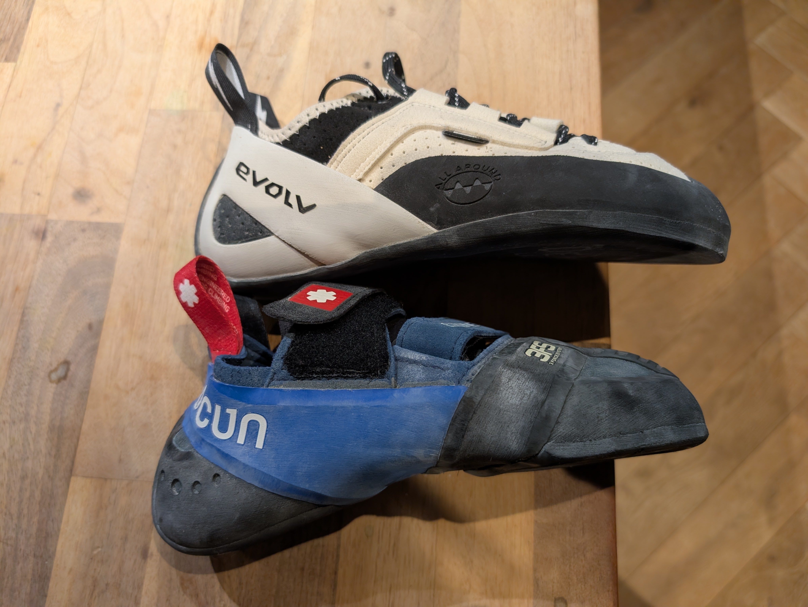

Choosing the right tool for the job can be challenging because it's not just about what's best for that specific use case, but also what works best for you, given your skill level, your personal goals, and how comfortable you feel with the tool so that you can advance at a reasonable speed.

Let me tell y'all the story of how I sabotaged myself (and my own progress) by insisting on using a tool that was not the right choice for me. 

Last year, after being convinced by my daughter (9) who started having climbing lessons in her after-school program, I started climbing too. Indoor bouldering is a fairly popular sport here in The Netherlands, with several climbing gyms throughout the country. And so it happened that a climbing gym opened very close to our home, so it was a) convenient (both because it was close but also because it's an indoor sport so you don't depend on the weather); b) fun; and 3) very challenging.

Bouldering in general requires the use of special shoes. Climbing shoes are known for being uncomfortable, so it takes some time to get used to them. It took me quite a few attempts to find a pair of climbing shoes that I was able to use without too much pain. Usually, as a beginner you start with a shoe two (sometimes three) sizes bigger than your regular shoe size. 

And that was fine. My first pair was two sizes bigger and it was good for a long time! I was progressing. 

Fast-forward to some 6 months later, my right shoe now had a hole in the tip, and it was very slippery. It was time to go for my *second* pair of climbing shoes.

And that's when the problems started. Because I had progressed a lot in that period, I thought I was ready for "the next step", getting a shoe slightly smaller for better performance. I believed that was the next logical step in my climbing progress. I did my research, and I bought a new pair that was size 40 (my regular size is 39, EUR size). My first pair was 41.

At first I was impressed because the new shoes were really good! Perfect grip, great tip. Or course, they were not comfortable. It was painful but I thought I just needed to get out of my comfort zone for a while, until the shoes felt good. They did get better, but it was still painful. I started having some pain in my big right toe outside of the climbing session, and during the climbing sessions it started to become clearly unbearable: I was afraid of jumping because it hurted my feet, I lost my confidence, and I just stopped progressing at all, always thinking that with just a few more sessions I would finally get used to these damn good shoes. Which I didn't.

Eventually I realized I wasn't ready for the damn good climbing shoes and I should just go a step back to my beginner shoes. Even with a hole in one of them, I was able to climb so much better! So I got yet another pair of climbing shoes, this time a bigger size (back to 41) and with laces, so that I could tie them well and make them adapt to my weird, wide feet. 

And just as expected, I started progressing again. 

_I think it is clear who is who in this picture, right? The white and black one is my new favorite!_

Don't let yourself be influenced by all the hype out there; give yourself the space to grow and learn at a pace that is not too comfortable but also not too aggressive that will burn you out. As a beginner you may feel tempted to skip steps in order to progress faster, but that will cause other foundational issues that you can't predict. Keep the pace, ignore the FOMO, choose the right tools for you and don't get fooled by a damn good pair of unbearably tight shoes 😄

